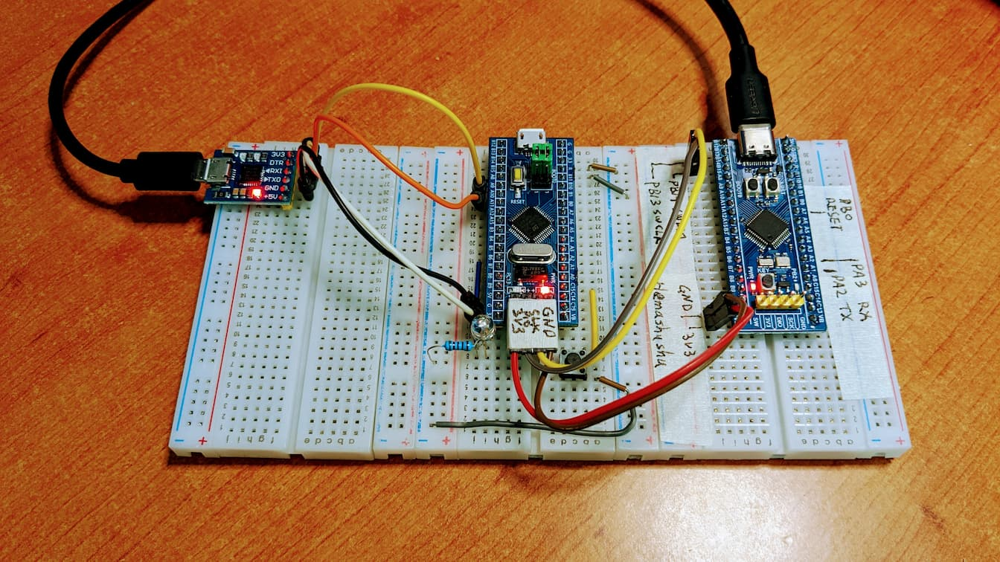

# MCU STM32F103C8T6 Bare-metal in Rust

[EN](README.md) | [中文](README.zh-Hans.md)

A bare metal (register level) STM32F103C8T6/STM32F103 MCU program in Rust without any IDE, SDK, HAL or libraries, the only tool required is the Rust compiler.

## Implemented Features

- GPIO read and write
- Set system clock
- SysTick and interrupt
- UART read and write

<!-- [Demo](https://user-images.githubusercontent.com/394223/201260032-29f48a6d-eabd-4531-9e00-344b9ef80781.mp4) -->

[Demo video](images/stm32f103-v2.mp4)

<video width="480" height="270" controls>
  <source src="images/stm32f103-v2.mp4" type="video/mp4">
</video>

## Source Code Structure

- `src/register_*.rs` Definition of register structures and values
- `src/startup.rs` startup and vector array
- `src/main.rs` main program
- `.vscode/launch.json` configuration file for VSCode debug
- `svd/` `System View Description` file for displaying various register names and address values during GDB debugging
- `build.sh` script for compiling
- `flash.sh` script for compiling and downloading firmware

## Wires

- PC13: builtin LED -
- PB5: external LED +
- PA0: button (the button another pin connect to GND)
- PA9: USART1_TX -> CP2012 RX
- PA10: USART1_RX -> CP2012 TX

## Compile

Install `Rust` on your platform first, then run:

`$ ./build.sh`

## Flash

Connect the MCU to your computer using the `CMSIS_DAP debugger` (hardware) and then run:

`$ ./flash.sh`

## Debug

`$ ./server-gdb-server.sh`

then open another terminal, and run:

`$ ./start-gdb-client-with-svd.sh`

## Reference Documents

Hardware description and register structure and value description documentations:

- STM32F103c8 Datasheet
  https://www.st.com/resource/en/datasheet/cd00161566.pdf

- RM0008 Reference manual
  https://www.st.com/resource/en/reference_manual/cd00171190-stm32f101xx-stm32f102xx-stm32f103xx-stm32f105xx-and-stm32f107xx-advanced-arm-based-32-bit-mcus-stmicroelectronics.pdf

- PM0214 Programming manual
  https://www.st.com/resource/en/programming_manual/pm0214-stm32-cortexm4-mcus-and-mpus-programming-manual-stmicroelectronics.pdf

For those who want to know how it works and who want to go further and implement more features, check out these:

- Bare metal programming guide (C lang on STM32F429)
  https://github.com/cpq/bare-metal-programming-guide

- The Embedonomicon
  https://docs.rust-embedded.org/embedonomicon/

- libopencm3 project
  https://github.com/libopencm3/libopencm3
