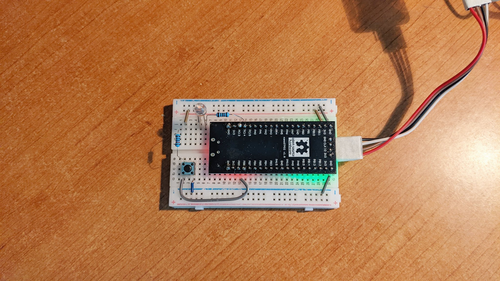

# 使用 Rust 编写微处理单元 (MCU STM32F103C8T6) 的 "裸机" 程序

[EN](README.md) | [中文](README.zh-Hans.md)

一个用 Rust 编写的微处理单元（MCU STM32F103C8T6）的 "裸机" 程序，不依赖 SDK、IDE 或者任何库，唯一需要的是 Rust 编译器。通过直接读写硬件的寄存器实现信号的输入和输出、定时器、串口通信等。

## 已实现的功能

- GPIO 读和写
- SysTick
- UART 读和写

[Demo](https://user-images.githubusercontent.com/394223/201260032-29f48a6d-eabd-4531-9e00-344b9ef80781.mp4)

<video width="480" height="270" controls>
  <source src="images/stm32f103.mp4" type="video/mp4">
</video>

## 源代码目录结构

- `src/type_*.rs` 寄存器结构和常量的定义
- `src/vector.rs` 微处理单元的 `vector` 数列构造
- `src/main.rs` 演示程序
- `.vscode/launch.json` VSCode 调试器的配置文件
- `svd/` 用于 GDB 调试时显示各个寄存器名称和数值的数据文件
- `flash.sh` 编译和下载固件的脚本

## 参考文档

程序当中的寄存器结构和常量来自 STM32 的硬件数据手册：

- PM0214 Programming manual
  STM32 Cortex®-M4 MCUs and MPUs programming manual
  https://www.st.com/resource/en/programming_manual/pm0214-stm32-cortexm4-mcus-and-mpus-programming-manual-stmicroelectronics.pdf
- STM32F103c8 Datasheet
  https://www.st.com/resource/en/datasheet/cd00161566.pdf
- RM0008 Reference manual
  STM32F101xx, STM32F102xx, STM32F103xx, STM32F105xx and
  STM32F107xx advanced Arm®-based 32-bit MCUs
  https://www.st.com/resource/en/reference_manual/cd00171190-stm32f101xx-stm32f102xx-stm32f103xx-stm32f105xx-and-stm32f107xx-advanced-arm-based-32-bit-mcus-stmicroelectronics.pdf

对于想了解工作原理，以及想进一步实现更多功能的：

- Bare metal programming guide (C lang on STM32F429)
  https://github.com/cpq/bare-metal-programming-guide

- 项目 libopencm3
  https://github.com/libopencm3/libopencm3

